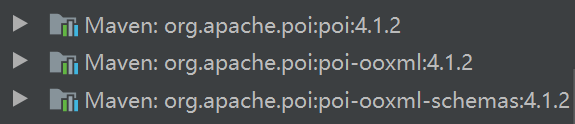

## 自定义execl导入导出功能的实现 

### Step01 引入maven依赖

    <!-- excel工具 -->
         <dependency>
             <groupId>org.apache.poi</groupId>
             <artifactId>poi-ooxml</artifactId>
             <version>4.1.2</version>
          </dependency>

 ####会下载以下依赖包
     
  
    
    
   
 
 